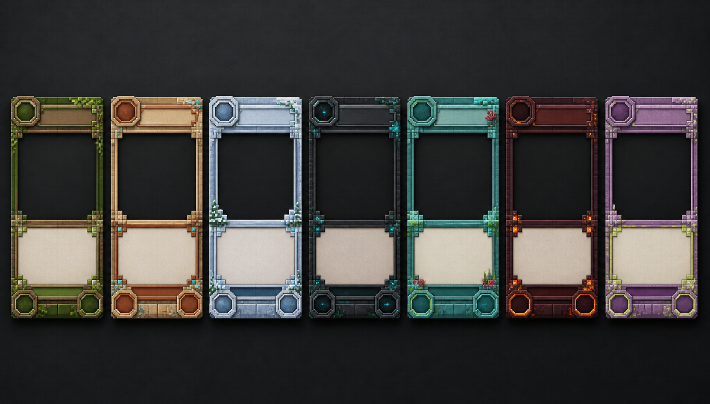

# 卡面设计系统 v0.1

> 目标：同一套可批量生产的卡面骨架，通过群系主题令牌、边框材质和角标区分阵营；任何时候优先保证中文可读性。

## 1. 视觉样张



样张由内置 imagegen 生成，并由项目负责人指定为当前可玩 Demo 的卡框视觉基准。构建脚本将该样张同步到 Unity 受控资源目录，`DemoCardFrameProvider` 按固定群系顺序切出七套框体；卡名、费用、物品图、规则、类型和属性仍由 Unity 模板与注册数据实时叠加，不得烘焙进样张。

当前切片用于原型阶段锁定风格，不等同于最终发行资产。进入正式资源阶段时，需要按相同槽位和稳定资源路径导出透明背景、可九宫格缩放的独立框体，但不得重新退回通用纯色框或让卡牌复用战场 HUD 的石砖容器。

## 2. 标准布局

设计基准画布为 `750 × 1050`，比例 `5:7`。实际 UI 使用锚点和九宫格缩放，不依赖固定像素。

| 区域 | 纵向范围 | 内容 | 可读性约束 |
|---|---:|---|---|
| 标题栏 | 3%–13% | 费用、名称、稀有度 | 名称最多两行；缩小字号前优先减少装饰宽度 |
| 插画窗 | 14%–57% | 物品图、实体渲染或场景插画 | 原版像素图使用整数倍最近邻缩放，禁止平滑滤镜 |
| 规则区 | 59%–84% | 关键词与完整描述 | 统一浅色低纹理底；正文不直接压在插画上 |
| 类型栏 | 85%–91% | 类型与关键标签 | 最多显示 2 个主要标签，其余进入详情面板 |
| 属性区 | 88%–98% | 攻击、生命、耐久或建筑生命 | 颜色之外同时使用固定位置和图形轮廓区分 |

安全边距为短边的 4%。任何装饰不得进入规则区正文安全框。

## 3. 信息层级

1. 费用、攻击、生命是战场缩略图仍需识别的一级信息。
2. 名称和类型是手牌尺寸需识别的二级信息。
3. 完整描述、标签和稀有度在悬停/放大状态阅读。
4. 群系颜色只表达身份，不表达稀有度或正负状态。
5. 卡牌类型除文字外还使用轮廓：生物为双属性角标，建筑/结构为单生命基座，法术/材料不显示空属性框，装备显示攻击与耐久。

## 4. 七群系主题

精确颜色以 `shared-schema/card-data/card-theme-registry.v1.json` 为唯一来源。

| 群系 | 材质母题 | 主色方向 | 点缀 | 禁止事项 |
|---|---|---|---|---|
| 平原 & 森林 | 橡木、树叶、苔藓 | 深草绿 | 麦金 | 大面积高饱和荧光绿 |
| 沙漠 & 恶地 | 砂岩、红陶 | 焦赭 | 氧化铜青 | 黄底白字、密集沙粒覆盖正文 |
| 雪山 & 冰原 | 浮冰、云杉 | 冰川蓝 | 冰晶青白 | 纯白边框导致轮廓消失 |
| 洞穴 & 黑森林 | 深板岩、幽匿 | 炭黑绿 | 幽匿青 | 大面积发光纹理干扰文字 |
| 海洋 & 河流 | 海晶石、珊瑚 | 深海青 | 珊瑚金 | 高饱和蓝绿直接承载正文 |
| 下界 | 黑石、下界砖 | 暗血红 | 熔岩橙 | 全框持续发光、红字黑底正文 |
| 末地 | 紫珀、末地石 | 深紫 | 末影黄绿 | 紫色和稀有度颜色混用 |

## 5. 字体与文本

- 正文使用覆盖简体中文的无衬线字体；正式引入时固定字体文件版本和许可证。
- 标题可使用略方正的展示字，但不能直接使用 Minecraft 商标字体。
- 规则文本建议 2–4 行；超过 5 行时先精简卡牌文本，不能无限缩小字号。
- 关键词使用字重、图标或色条强调，不依赖全大写或纯颜色。
- 正文与规则底的最低对比度为 `7:1`，标题与标题底最低为 `4.5:1`。

## 6. 图片资源层级

| 级别 | 用途 | 来源 | 是否提交仓库 |
|---|---|---|---|
| L0 原版图标 | 材料、物品、方块、临时生物标识 | 开发者本机合法安装的 Java 客户端 JAR | 否；通过脚本本地提取 |
| L1 实体渲染 | 正式生物卡 | 自有 Minecraft 场景截图/渲染，保留来源记录 | 评审后决定 |
| L2 原创插画 | 法术、叙事、终局卡 | 自制或明确授权 | 是 |
| L3 UI 装饰 | 边框、角标、状态图标 | 项目原创矢量/九宫格资源 | 是 |

原版纹理属于 Mojang/Microsoft 资产。当前流程只从开发者本机安装中按白名单提取，生成目录默认不进入 Git。若项目进入公开或商业阶段，必须重新核对当时有效的 Minecraft Usage Guidelines，并保留非官方声明和来源清单。

## 7. 生产规则

- 卡名、费用、属性、描述不得烘焙进插画或卡框图片。
- 七群系卡框顺序固定为平原森林、沙漠恶地、雪山冰原、洞穴黑森林、海洋河流、下界、末地；运行时映射集中注册在 `DemoCardFrameProvider`，业务 UI 不得通过下标自行裁切。
- `scripts/sync-card-frame-study.ps1` 保证设计样张和 Unity 运行时副本哈希一致，禁止手工分别修改两个副本。
- Prefab 不保存具体群系颜色；只保存语义槽位，由主题注册表注入。
- 所有卡牌通过稳定 `cardId` 查名称、主题、图像和玩法数据。
- 新卡注册必须同时通过：ID 唯一、名称键唯一、主题存在、图片资源状态明确。
- 原版纹理只能作为图标层，必须保留像素边缘，不应用有损 JPEG 压缩。

## 8. Unity Prefab 与渲染入口

- 唯一卡牌预制体为 `Assets/Game/Demo/UI/Resources/DemoUI/Prefabs/CardUI.prefab`，只保存稳定骨架组件，不保存具体卡牌数据或群系颜色。
- `DemoCardUiFactory` 是手牌、详情面板和后续战场卡牌展示的统一实例化入口；`CardUI.Bind` 根据 `cardId` 注入卡框、名称、费用、立绘、规则、类型与属性。
- `CardDetailsView` 不维护另一套详情卡布局，而是直接通过同一 Factory 实例化非紧凑尺寸的 `CardUI.prefab`。任何卡面修正必须同时影响手牌与详情视图。
- 立绘窗口使用点采样、可平铺的深色黑石像素底材 `ArtSurface`，不允许透明窗口直接露出纯黑 UI 底色。该纹理只作为卡内立绘承托面，不替代群系外框，也不复用 HUD 容器层级。
- 费用、攻击、生命/耐久插槽统一由 `DemoCardFrameProvider` 从当前群系卡框图集中裁切，禁止用无纹理纯色 `Image` 临时补位。

## 9. imagegen 样张提示词

使用模式：内置 imagegen；分类：`ui-mockup`。

```text
Create one polished landscape design board showing seven blank vertical collectible-card frames side by side. Every frame uses exactly the same clean 5:7 layout: cost socket, title band, large art window, high-contrast rules panel, type strip, and two lower stat sockets. Differentiate seven biome variants with restrained oak/leaf, sandstone/terracotta, packed-ice/spruce, deepslate/sculk, prismarine/coral, blackstone/ember, and purpur/end-stone materials. Shippable modern digital card UI, minimal blocky pixel accents and crisp geometry. No text, letters, numbers, logos, characters, item art, trademarks, or watermark. Keep layouts identical and readable; avoid ornate existing card-game silhouettes.
```
