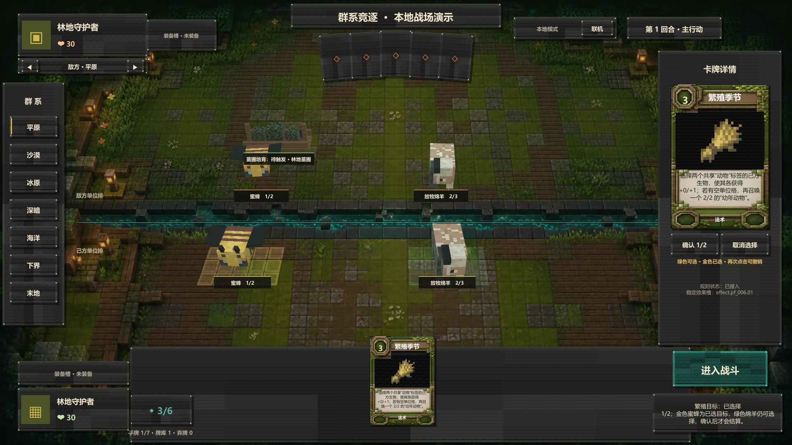

# 繁殖季节双目标规范 v1

本规范对应 `protocolVersion 22`、`rulesetVersion prototype-0.32` 与内容版本 24。

## PF-006 繁殖季节

- 繁殖季节是 `3` 费自然 / 繁殖法术。
- 使用前必须选择两个不同、存活、由施法者控制且带 `animal` 标签的单位。目标不要求相邻，也不要求卡牌 ID 相同。
- 服务端在扣除红石、移出手牌和生成任何事件之前，原子校验两个稳定实例 ID；缺少目标、重复目标、敌方目标、非单位、非动物或已离场目标都会拒绝整条命令。
- 合法目标按 `slotIndex`、`instanceId` 重新排序后分别永久获得 `+0/+1`，当前生命与最大生命同时增加 `1`，客户端点击顺序不得改变事件顺序。
- 两次成长完成后，如果施法者存在空单位格，则在最左侧空格召唤 `TK-003 幼年动物`；如果四个单位格均被占用，只跳过召唤，两个目标仍正常成长。

## 协议与事件顺序

- `PLAY_CARD.payload` 新增可选字段 `targetInstanceIds`，类型为恰好两个不重复的 `object-*` 实例 ID；因此协议升级到 `protocolVersion 22`。
- PF-006 命令必须使用 `targetType = UNIT` 和 `targetInstanceIds`，不得用单目标 `targetInstanceId` 代替。
- 合法事件顺序为：`CARD_PLAYED` → 目标一 `OBJECT_STATS_CHANGED` → 目标二 `OBJECT_STATS_CHANGED` → 可选 `OBJECT_SUMMONED` → 光环重算 → 林地苗圃成长 → 珊瑚礁成长。
- 两个成长事件使用 `effect.pf_006.01`、`reason = PERMANENT_HEALTH_MODIFIER`，并携带各自最终攻击、当前生命、最大生命和临时攻击字段。
- 幼年动物使用独立稳定实例 ID，并把 `sourceInstanceId` 绑定到本次 `CARD_PLAYED` 的 `effect-<eventId>`；它具有动物 / 幼体标签，因此属于真实召唤，可触发本回合尚未触发的林地苗圃。

## Unity 交互

- 点击“选择两个己方动物”后进入双目标模式；所有合法动物所在的真实 3D 地表使用普通叶绿色高亮，已选择目标使用更高优先级的暖金地表高亮。
- 点击合法目标可加入或移出选择，状态栏和右侧确认区持续显示 `已选择 n/2`；选择两个目标后仍需点击“确认繁殖”，不得在第二次点击时立即施法。
- `Esc`、右键或“取消”按钮清空整个双目标选择；切换卡牌、阵营或阶段同样不得保留陈旧实例 ID。
- 联机客户端只提交实例 ID，不能预先修改生命或生成幼体；收到权威事件后按顺序播放两个成长脉冲和可选召唤表现。
- `TK-003` 复用 Minecraft 绵羊纹理和分件模型，并缩放为幼体比例，不使用通用方块生物占位。

实际 Windows 构建中的 1/2 选择态：

## 验收

- 两个合法动物各永久获得 `+1` 最大生命；命令顺序互换不改变权威事件顺序。
- 任一非法目标都会使命令无费用、无弃牌、无事件地失败。
- 有空格时召唤一只 `2/2` 幼年动物；满场时不召唤且成长仍生效。
- 双目标命令经过 Unity 序列化后严格包含两个不重复实例 ID；本地、在线和服务端规则一致。
