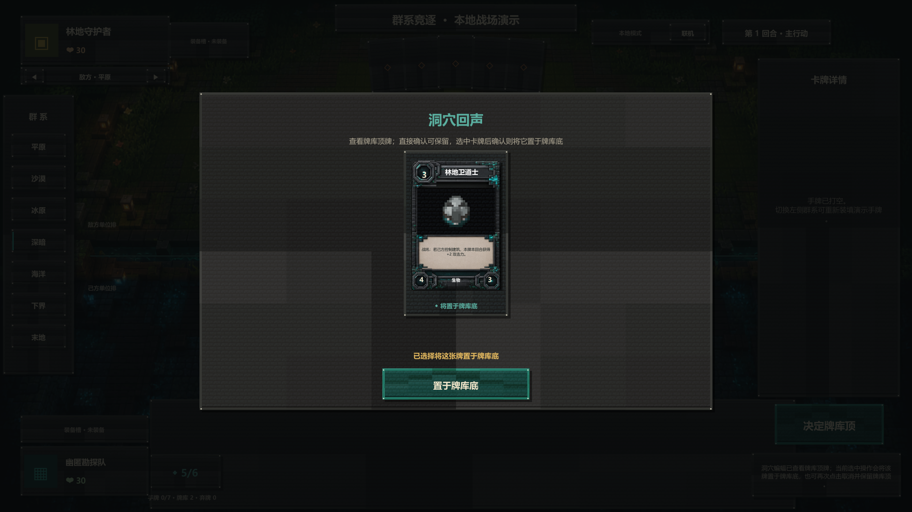

# 洞穴蝙蝠牌库顶窥视规范 v1

本规范对应 `protocolVersion 28`、`rulesetVersion prototype-0.45` 与内容版本 37。

## 规则语义

- CD-001 洞穴蝙蝠部署成功后触发 `effect.cd_001.01`。
- 若己方牌库非空，拥有者私下查看恰好一张牌库顶牌，并选择“保持原位”或“置于牌库底”。
- `selectedOptionIndex = -1` 表示保持原位；`selectedOptionIndex = 0` 表示把当前牌库顶移动到牌库底。
- 牌库为空时不创建选择、不中断主行动阶段，也不产生空的 `CHOICE_OFFERED`。
- 选择存在期间除认输外的其他命令继续由通用选择锁拒绝。

## 权威状态与隐私

- 牌库数组继续使用“索引 0 为底、末尾为顶”的既有约定；置底操作等价于从末尾移除并插入索引 0。
- 权威 `pendingChoice.kind` 为 `TOP_CARD_SCRY`，只包含 `optionIndex = 0`、当前牌库顶 `cardId`、`slotIndex = -1` 与 `selectable = true`。
- 拥有者快照和 `CHOICE_OFFERED` 收到真实牌名；对手投影保留一个不可选占位，其 `cardId = null`。
- `CHOICE_RESOLVED.selectedOptionIndex` 对双方公开，用于表达保留或置底；非拥有者投影的 `selectedCardId` 始终为 `null`。
- 解决前重新核对权威牌库顶与选项一致；状态漂移属于服务端不变量错误，不静默操作另一张牌。

## Unity 交互

- CD-001 复用通用阻断式牌库选择层，不创建专用 Web 风格弹窗。
- 直接确认按钮显示“保留牌库顶”；点击唯一卡面后切换为“置于牌库底”，再次点击取消选择。
- 卡槽使用洞穴青色材质反馈，与考古学家的暖金色选中态区分。
- `-previewBatScry` 固定使用洞穴/深暗己方半场，部署 Minecraft 蝙蝠模型并停留在置底确认态，用于视觉回归。

## 验证边界

- 服务端测试覆盖置底、保留、空牌库、对手事件与快照隐私以及 JSON Schema。
- Unity 测试覆盖离线规则等价、选择重放、对手隐私投影和空牌库分支。
- Docker 冒烟测试继续验证版本锁、匹配、调度和权威命令链，确保协议升级没有破坏已有联机流程。

