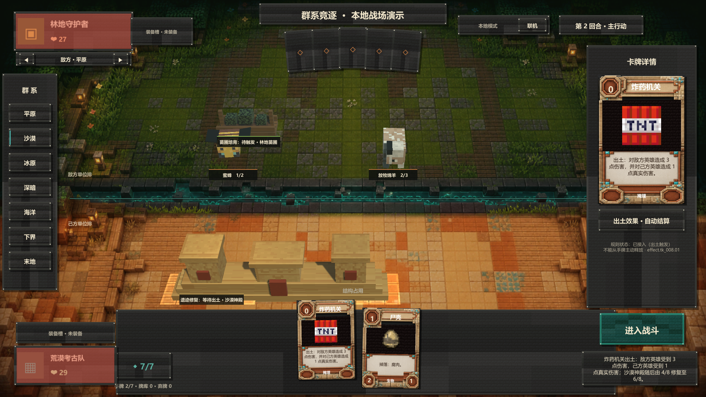

# DB-007 沙漠神殿掩埋链规范 v1

本规范对应 `protocolVersion 28`、`rulesetVersion prototype-0.44` 与内容版本 36。

## 权威规则

- 沙漠神殿是费用 5、8 点生命、连续占用 2 个建筑格的结构。
- 以红石部署时，战吼依次将 1 张“藏宝图”与 1 张“炸药机关”插入己方隐藏牌库；以 `DB-002 + TK-006` 合成部署时同样触发战吼，并在入场前获得 +2 当前与最大生命。
- 两张掩埋牌分别使用权威服务端秘密随机源选择插入位置；随机种子与计数器只保存在 `MatchState`，不得投影给客户端。权威事件顺序固定为 `CARD_DEPLOYED → CARD_BURIED(TK-007) → CARD_BURIED(TK-008)`，合成时 `MATERIALS_CONSUMED` 位于部署事件之前。
- 抽到掩埋牌时先将其从牌库与掩埋集合移除，按手牌上限送入手牌或弃牌堆，并发出 `CARD_EXCAVATED`；之后完整执行该牌的出土效果。
- 藏宝图出土时生成 1 张“绿宝石”（TK-018）。若手牌已满，绿宝石进入公开弃牌堆。
- 炸药机关出土时先对敌方英雄造成 3 点普通伤害（护甲优先吸收），再对己方英雄造成 1 点真实伤害。
- TK-006、TK-007、TK-008 的效果注册状态为 `IMPLEMENTED`，同时 `manualPlayAllowed = false`；它们进入手牌后仍不能主动释放，只能由出土流程触发效果。
- 炸药机关两段伤害都完成后统一判定胜负；若双方同时归零，因卡面按“敌方伤害→己方伤害”书写，敌方英雄先败，出土牌拥有者获胜。对局结束后不再继续本次正常抽牌。

## 神殿治疗与事件顺序

- 任一己方掩埋牌完成自身出土效果后，所有仍存活的己方沙漠神殿按起始建筑格、实例 ID 的稳定顺序各恢复 2 点生命，不超过各自最大生命。
- 当前三建筑格规则下合法战场至多容纳一座己方沙漠神殿；稳定多实例顺序是为未来扩容、复制或临时规则保留的防御性约定。
- 神殿即使已经满生命也会响应，并发出治疗量为 0 的属性事件，以保证“每当出土”的触发具有可回放反馈。
- 神殿治疗事件使用 `sourceCardId = db_007`、真实神殿 `sourceInstanceId`、`effectId = effect.db_007.01`、`reason = HEAL`。
- 完整顺序为 `CARD_EXCAVATED → 掩埋牌自身效果事件 → 每座神殿的 OBJECT_STATS_CHANGED → 可选 MATCH_ENDED → 可选后续普通抽牌`。

## 隐私与 Unity 表现

- `protocolVersion 25` 将投影给非拥有者的 `CARD_BURIED.payload.cardId` 改为 `null`；拥有者与权威状态仍保留真实牌名，牌库只公开总数与掩埋数量。当前协议 26 继续保留这一隐私约束。
- 沙漠神殿使用贴合双建筑格的 Minecraft 砂岩、切制砂岩与橙色陶瓦体素模型，不使用通用双塔占位结构。
- 神殿作为持续响应引擎显示低强度沙金地表脉冲；出土触发治疗时脉冲真实神殿对象并显示“遗迹修复”，炸药机关同时脉冲双方英雄 HUD。

