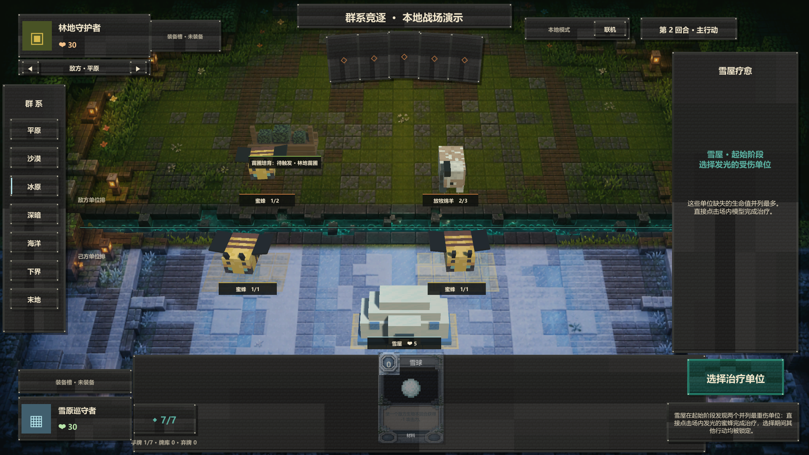

# SI-007 雪屋起始阶段治疗规范 v1

本规范对应 `protocolVersion 30`、`rulesetVersion prototype-0.47` 与内容版本 39。

## 权威规则

- 雪屋是费用 3、5 点生命、占用 1 个建筑格的回复建筑。
- 在其控制者的起始阶段，每个存活雪屋独立为一个“受伤最重”的己方生物恢复 1 点生命；满血生物不参与候选，战场没有受伤生物时该次触发不产生空事件。
- “受伤最重”按缺失生命值 `maxHealth - health` 判定，而不是按当前生命最低判定。只统计存活的己方单位，不统计英雄、建筑或结构。
- 多个雪屋按建筑格、实例 ID 的稳定顺序逐个结算。每次治疗后重新计算候选，因此前一个雪屋可能改变后一个雪屋的目标。
- 唯一候选自动治疗；最大缺失生命并列时，由当前回合玩家选择。对局在选择完成前由通用选择锁阻止除认输外的其他命令。

## 起始阶段与事件顺序

当前起始阶段顺序固定为：刷新回合状态与红石 → `TURN_STARTED` → 常规抽牌/出土链 → 雪屋。若抽牌或出土效果已经结束对局，雪屋不再触发。

- 唯一目标：直接发出 `OBJECT_STATS_CHANGED(reason=HEAL, effect.si_007.01)`。
- 并列目标：发出 `CHOICE_OFFERED(kind=HEAL_UNIT)`；选定后发出 `CHOICE_RESOLVED`，再发出治疗属性事件。
- 若仍有未结算雪屋，选择解决后在同一命令批次继续处理；遇到新的并列则产生下一个稳定选择并再次锁定。
- 雪屋找到至少一个受伤候选时记录 `sourceInstanceId:effect.si_007.01` 触发键；没有候选时不写入无事件、无法回放的空标记。起始阶段解析器在该回合不会因后续受伤而自行再次运行。

## 联机投影与客户端交互

- `HEAL_UNIT` 的候选来自公开战场信息，双方都能看到 `cardId` 与 `slotIndex`；只有选择拥有者的选项带 `selectable=true`。
- Unity 不使用遮挡战场的卡牌选择弹窗。合法目标直接通过 3D 地表材质和单位所在格高亮，点击场内单位完成治疗。
- 右侧检查器显示雪屋来源和判定说明；选择期间手牌、阶段切换和其他战场动作保持锁定。
- 离线对手没有真实输入者，并列时按单位格、实例 ID 顺序自动选择最左候选；权威联机对局始终等待对应玩家选择。

## 验证边界

- 覆盖唯一最重伤自动治疗、并列公开选项与选择锁、多雪屋治疗后重算、对手投影、事件 Schema、纯事件回放与离线对手确定性策略。
- 雪屋场景模型使用本机 Minecraft Java JAR 白名单提取的雪块与浮冰材质；生成纹理仍遵循不提交仓库策略。

## 场景预览

