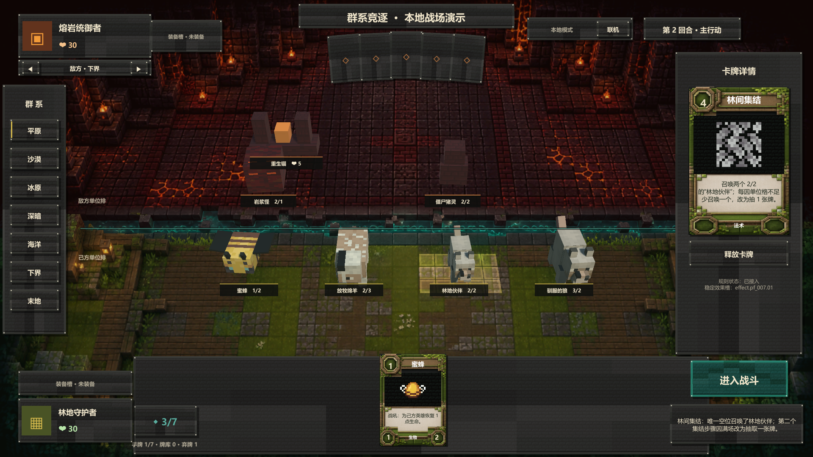

# 林间集结召唤 / 抽牌规范 v1

本规范对应 `protocolVersion 22`、`rulesetVersion prototype-0.33` 与内容版本 25。

## PF-007 林间集结

- 林间集结是 `4` 费自然法术，不需要目标。
- 效果由两个按顺序执行的“集结步骤”组成。每一步开始时若己方存在空单位格，则在最左侧空单位格召唤一个 `TK-004 林地伙伴`；否则改为抽一张牌。
- 因此有至少两个空格时召唤两个；只有一个空格时先召唤一个、再抽一张；没有空格时连续抽两张。
- 每次召唤都是独立的真实 `OBJECT_SUMMONED`，需要立即重算相邻光环，并触发尚未消耗的林地苗圃或珊瑚礁。林地伙伴具有 `animal` 标签，因此第一只可触发本回合尚未触发的林地苗圃；同一苗圃不会因第二只再次触发。
- 替代抽牌沿用普通抽牌规则：七张满手会公开爆牌，空牌库会依次产生递增疲劳。若一次疲劳已造成致命伤害并结束对局，不再执行后续集结步骤。

## 事件与确定性

- 合法事件以 `CARD_PLAYED` 开始，两个集结步骤严格按索引 `0 → 1` 执行。
- 召唤步骤产生 `OBJECT_SUMMONED`，随后才产生该单位引发的光环与持续效果事件；抽牌步骤产生既有 `CARD_DRAWN`、`CARD_BURNED` 或 `FATIGUE_DAMAGE`。
- 召唤使用 `effect.pf_007.01`，`sourceInstanceId` 绑定本次施法的 `effect-<CARD_PLAYED eventId>`，不能依赖客户端生成对象 ID。
- 效果不新增网络字段，因此保持 `protocolVersion 22`；规则集升级到 `prototype-0.33`。

## Unity 表现

- 卡牌可直接从右侧详情区释放，不进入目标选择模式。
- 每个 `OBJECT_SUMMONED` 依次在真实 3D 单位格播放地表脉冲；抽牌或爆牌继续使用现有手牌区反馈。
- `TK-004` 复用 Minecraft 狼的分件模型与纹理，并缩小到林地伙伴比例，不显示通用方块占位。
- 提供一格空位的预览场景，必须可同时观察到新召唤的林地伙伴与一次替代抽牌结果。

实际 Windows 构建中的一格空位结算态：

## 验收

- 2、1、0 个空单位格分别得到 `2 召唤 / 0 抽牌`、`1 召唤 / 1 抽牌`、`0 召唤 / 2 抽牌`。
- 两次步骤的事件顺序稳定；苗圃只强化本回合第一个入场动物。
- 满手、空牌库与致命疲劳沿用统一抽牌结算，不创建特殊旁路。
- 本地规则、权威服务端、Unity 表现与联机快照最终状态一致。
