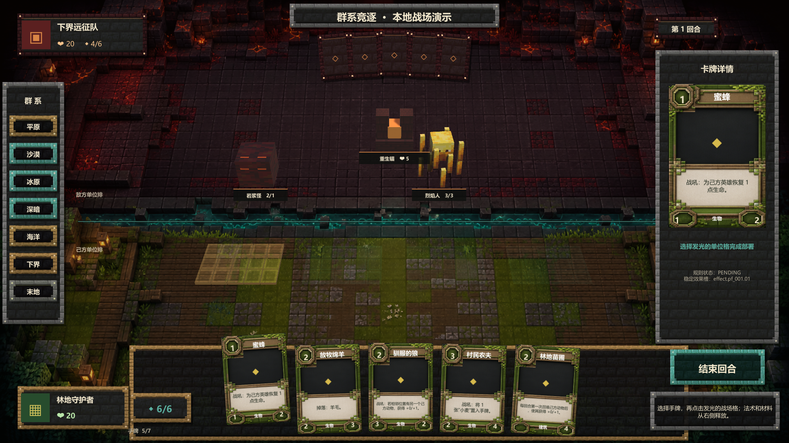

# Minecraft: Biome Rivals

这是《Minecraft：群系争霸》的最小工程骨架。当前目标不是一次写完玩法，而是先建立一个可构建、可测试、可替换依赖的纵向切片：

- `client-unity/`：Unity 6 客户端，按 Core / Networking / Presentation / Bootstrap 分层；
- `server-nakama/`：Nakama TypeScript Runtime 与不依赖运行时的纯规则核心；
- `shared-schema/`：客户端和服务端共同遵守的 JSON Schema 协议；
- `ops/` 与 `docker-compose.yml`：本地 Nakama + PostgreSQL；
- `scripts/`：环境发现、安装和统一验证入口；
- `docs/decisions/`：影响长期维护的架构决策记录。

## 快速开始

前置环境：Node.js 20、npm、Docker Desktop，以及 Unity 6.0 中国版 `6000.0.28f1c1`。不要把生产账号或密码写入仓库。

```powershell
Copy-Item .env.example .env
.\scripts\bootstrap.ps1
npm test
docker compose up --build
```

另开终端查找并打开 Unity 工程：

```powershell
.\scripts\find-unity.ps1
```

卡牌内容流水线：

```powershell
# 从原型卡表生成完整定义、中文文本和稳定效果槽，并同步到 Unity Resources
.\scripts\sync-card-content.ps1

# 从本机 Minecraft Java JAR 按白名单提取临时卡图（生成物不提交 Git）
.\scripts\extract-minecraft-card-icons.ps1

# 检查 74 个定义/文本/卡图映射、7 套主题和文字对比度
.\scripts\validate-card-content.ps1

# 直接调用锁定版本的 Unity，编译并运行 EditMode 测试
.\scripts\validate-unity.ps1
```

卡面规范与七群系视觉样张见 [Card Face Design System](docs/design/Card_Face_Design_System_v0.1.md)，内容生成规则见 [Card Content Registry](docs/design/Card_Content_Registry_v0.1.md)。Minecraft 原版图标仅供本地原型验证，公开发布前需要重新核对当时有效的官方使用规范。

## 最基础可玩 Demo

Unity 中打开 `client-unity/Assets/Game/Demo/Scenes/Demo.unity` 后点击 Play。当前 Demo 是便于快速验证卡牌和 UI 的离线展示沙盒（初始红石为 6；正式权威规则按 GDD 从 1 开始），使用与精绘背景消失方向匹配的固定斜俯视透视摄像机，将真实 3D 方块棋盘与屏幕空间卡牌 UI 组合为 2.5D 战场，并支持：

- 七个群系主题即时切换，每个群系装载 5 张已注册卡牌；
- 选择手牌并部署到 4 个单位格或 3 个建筑格；
- 多格结构检查完整连续建筑空间；选择结构后只把合法起点标为可用，悬停会让整段真实地表同步变金，越界或重叠范围整段变红且不会发送无效联机命令；
- 部署交互生成与联机网关一致的 `DEPLOY_CARD` 命令，并按 revision 拒绝重复或过期操作；
- 主行动/战斗阶段切换，选择己方攻击者后高亮敌方生物、建筑与英雄目标；
- 嘲讽由服务器过滤普通攻击目标，场内单位显示关键词铭牌并以金色贴地材质标记强制目标；冲锋关键词可绕过召唤回合攻击限制；
- 普通攻击同步反击、当前生命显示、死亡释放格子及英雄生命归零胜负；
- `潜影贝`亡语已接入服务端死亡结算：生成的`潜影壳`只向拥有者公开；手牌满 7 张时直接公开进入弃牌堆；
- `岩浆怪`亡语已接入批量死亡队列：同批对象全部离场后召唤 1/1`小型岩浆怪`，优先复用来源释放的单位格；
- 每回合开始抽牌、7 张手牌上限、公开爆牌、弃牌计数与空牌库递增疲劳；
- 权威联机开局按 GDD 执行先手 3 张、后手 4 张与双方各一次任意数量起手调度；两人确认前战场输入保持锁定；
- 法术、材料和装备的费用校验、实现状态提示与弃牌区流转；
- `熔岩献祭`、`腐肉`、`潜影壳`与有目标的`雪球`已接入真实权威效果；雪球使用 3D 地表高亮选择敌方单位，支持右键/Esc 取消并在回合结束恢复临时减攻；其余效果在 UI 中明确标记为待接入；
- 红石能量、结束回合、模拟对手回合和下一回合补充；
- 3D 单位/建筑后备模型、轻微待机动画，以及按 `cardId` 热替换正式 Prefab；多格结构以稳定对象实例为单位渲染并居中横跨其全部建筑格，相邻同名建筑不会被错误合并；
- 本机提取过 Minecraft 图标时自动显示像素物品，否则使用无版权占位符。

Nakama 权威规则已支持开局快照、私有牌库投影、起手调度、抽牌/爆牌/疲劳、部署校验、阶段切换、嘲讽、冲锋接口、无目标及首个单目标法术/材料、普通攻击、反击/批量死亡、生成到手牌与召唤到战场两类亡语、英雄伤害、临时属性恢复、事件回放、结束回合与投降；Unity 侧已具备同构 DTO、快照/事件状态仓库和可替换传输接口。当前可玩场景默认使用离线规则执行器，联机按钮会接入锁定版本的 Nakama SDK 适配器并复用同一命令协议；构筑校验、不可指定状态、正式冲锋卡牌、同一控制者手动排列同时触发顺序、更多目标类型与其余卡牌效果仍是后续玩法迭代。

重新生成场景或额外构建 Windows 演示包：

```powershell
.\scripts\build-demo.ps1
.\scripts\build-demo.ps1 -WithWindowsPlayer
.\scripts\build-demo.ps1 -WithWindowsPlayer -WithMinecraftAssets
```

`-WithMinecraftAssets` 会从本机已拥有的 Minecraft Java JAR 白名单提取 17 张方块贴图、6 张生物皮肤和卡牌图标。提取物与 Windows 构建均位于 Git 忽略目录，不会进入仓库。



布局、交互反馈、素材边界与背景生成记录见 [Demo UI 设计记录](docs/design/Demo_UI_Design_v0.1.md)。

在 Unity Hub 中打开 `client-unity/`。若使用的编辑器补丁版本与 `ProjectVersion.txt` 不同，先在独立分支完成升级并提交由 Unity 产生的项目文件变化。

## 日常命令

| 命令 | 用途 |
|---|---|
| `.\scripts\bootstrap.ps1` | 检查工具并按锁文件安装 Node 依赖 |
| `npm test` | 编译并运行服务端纯规则测试 |
| `npm run build` | 构建 Nakama JavaScript 模块 |
| `.\scripts\validate.ps1` | 执行仓库级静态检查、测试和构建 |
| `.\scripts\validate.ps1 -WithUnity` | 在统一验证中追加 Unity 编译与 EditMode 测试 |
| `.\scripts\build-demo.ps1` | 用锁定版本 Unity 重新生成可 Play 的 Demo 场景 |
| `docker compose up --build` | 启动 PostgreSQL 与 Nakama |
| `docker compose down` | 停止本地服务并保留数据库卷 |

## 工程约束

1. `server-nakama/src/rules` 不得访问网络、文件、系统时间或未注入的随机数。
2. 客户端只发送命令；服务端事件和快照才是权威状态来源。
3. 表现代码不能修改规则状态；第三方动画库必须藏在 `ITweenService` 后面。
4. 共享协议通过 `protocolVersion` 演进，玩法规则通过 `rulesetVersion` 演进，两者不能混用。
5. 每次新增命令、事件或规则，都必须补测试与协议定义。

玩法规格见 [Minecraft_Biome_Rivals_GDD_v0.5.md](Minecraft_Biome_Rivals_GDD_v0.5.md)，首轮 56 张机制验证卡见 [原型卡池 v0.1](docs/design/Minecraft_Biome_Rivals_Prototype_Cards_v0.1.md)，首个架构决定见 [ADR-001](docs/decisions/ADR-001-technical-foundation.md)。
